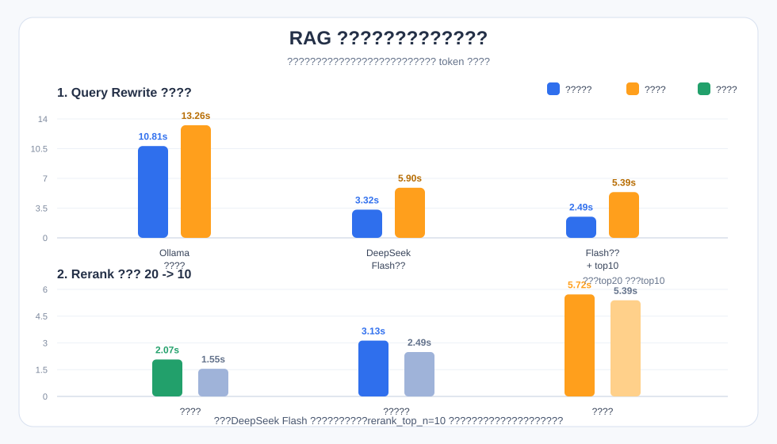

# RAG 文档问答系统

这是一个面向本地业务文档的 RAG 问答项目。系统会把示例文档切分为知识块，写入 Chroma 向量库；用户提问后，先进行问题改写，再通过向量检索、BM25 和 reranker 找到相关片段，最后调用 LLM 生成中文回答。

## AI 辅助安装

如果希望让 Codex 或 Claude Code 代为安装，请先下载本项目：

```text
https://github.com/shein341/livestream-helper
```

然后让 AI 代理按仓库内的安装 Skill 执行：

```text
请下载 https://github.com/shein341/livestream-helper，并按照 skills/install-skill/SKILL.md 来安装。
```


## 本地运行方式

### 前置要求

- 已安装 Docker Desktop 或 Docker Engine，并支持 `docker compose`
- 已安装并启动 Ollama，默认监听 `http://127.0.0.1:11434`
- 准备 OpenAI 兼容模型的 API Key，用于问题改写和最终回答生成

### 一键启动

首次运行前复制环境变量模板：

```powershell
copy .env.example .env
```

编辑 `.env`，填入真实 Key：

```env
RAG_QUERY_REWRITE_API_KEY=your_deepseek_key_here
RAG_ANSWER_API_KEY=your_answer_api_key_here
```

Windows：

```powershell
.\run.ps1
```

macOS / Linux：

```bash
chmod +x ./run.sh
./run.sh
```

脚本会自动检查 Docker、Docker Compose、Ollama、`.env` 和必需的 Ollama 模型；如果使用本地 Ollama 改写或本地 embedding，缺少对应模型时会自动执行 `ollama pull`。

启动后访问：

```text
应用：http://localhost:8000
Swagger：http://localhost:8000/swagger
```

停止服务：

```bash
docker compose down
```

运行测试：

```bash
python -m pytest -q
```

## 接口说明

### `POST /docs`

- 支持 `multipart/form-data` 上传文件：字段 `files`（可多个）。
- 也支持直接传文本入库：字段 `text`，可选 `source_name`（默认自动生成 `inline_*.md`）。

### `POST /chat`

- 非流式问答接口。
- 输入问题后执行：改写 -> 检索 -> rerank -> 置信度判断 -> 生成回答。
- 返回 `answer`、`references`、`pipeline`、`rewritten_query`、`fallback`。

### `POST /chat/stream`

- SSE 接口，返回 `pipeline_step`、`token`、`references` 事件。
- 检索和置信度判断完成后，直接消费回答模型的真实流式输出，并逐 token 推送。
- 如果命中置信度兜底，则不会调用回答模型，直接以 SSE 返回固定兜底文案。

## 关键权衡与参数演进

实现过程中主要做了以下取舍。

### 真实流式 vs 伪流式

最初可以用 `/chat` 得到完整回答后，再在 `/chat/stream` 里把字符串切碎模拟 SSE。但这种方式只是前端效果像流式，实际用户仍然要等完整回答生成完，首字符延迟没有改善。

当前选择：`/chat/stream` 直接消费回答模型的真实流式输出，并逐 token 转发给前端。

### 是否保留 Query Rewrite

不做改写最快，但用户问题可能口语化、缺少文档中的规范表达。例如用户问“提现前要满足啥”，文档里可能写的是“提现前置条件”。改写可以把自然问题规整成更适合检索的查询。

测试过的方案：

| 方案 | 预热后首字符 | 预热后最终完成 | 结论 |
|---|---:|---:|---|
| Ollama 本地改写 | 约 10.81s | 约 13.26s | 延迟过高，且会和本地 embedding 争用 Ollama |
| DeepSeek Flash 改写 | 约 3.32s | 约 5.90s | 延迟明显下降，质量稳定 |
| DeepSeek Flash 改写 + rerank_top_n=10 | 约 2.49s | 约 5.39s | 当前推荐方案 |

当前选择：保留 query rewrite，但使用 OpenAI 兼容接口调用 `deepseek-v4-flash`，并关闭思考：

```env
RAG_QUERY_REWRITE_PROVIDER=openai
RAG_QUERY_REWRITE_BASE_URL=https://api.deepseek.com
RAG_QUERY_REWRITE_API_KEY=your_deepseek_key_here
RAG_QUERY_REWRITE_MODEL=deepseek-v4-flash
RAG_QUERY_REWRITE_THINKING=disabled
```

改写形式也做过取舍：

- 关键词形式：`主播 提现 条件`，短，但可能损失语义关系。
- 陈述句形式：`主播提现前需满足的条件。`，稍长，但更接近用户真实意图，也更适合 embedding。

当前选择：改写成 40 字以内的中文陈述式检索句，而不是空格分隔关键词。

### Rerank 候选数 20 vs 10

Reranker 能显著降低误召回风险，但它的耗时和候选片段数近似正相关。原先默认 `rerank_top_n=20`，后来改为 `10`。

实测同一个问题“主播提现前需要满足哪些条件？”：

| 参数 | 检索完成 | 前端首字符 | 最终回答 |
|---|---:|---:|---:|
| `rerank_top_n=20` | 约 2.07s | 约 3.13s | 约 5.72s |
| `rerank_top_n=10` | 约 1.55s | 约 2.49s | 约 5.39s |

上面的关键延迟数据汇总如下：



命中质量没有明显下降：

```text
rewritten_query: 主播提现前需满足的条件。
top_score: 0.99818
top_source: 主播提现审核规则.md
fallback: False
```

当前选择：默认 `rerank_top_n=10`。如果未来文档规模变大或召回质量下降，可以再把它调回 20。

## 模型、向量库和 LLM 选型

### Embedding 模型

默认使用：

```env
RAG_EMBEDDING_MODEL=bge-m3:latest
```

选择原因：

- `bge-m3` 对中文语义检索支持较好，适合中文制度、规则、FAQ 类文档。
- 可以通过 Ollama 本地运行，降低部署门槛，避免 embedding 阶段依赖外部 API。
- 支持较通用的语义召回场景，对短问题和业务规则条款匹配比较稳定。

### 向量库

默认使用：

```text
Chroma
```

对应配置：

```env
chroma_dir=chroma_db
collection_name=rag_chunks
```

选择原因：

- Chroma 支持本地持久化，不需要额外部署数据库服务。
- 对小型到中型文档集足够轻量，适合演示、面试项目和本地知识库。
- 与 Python 生态集成简单，便于在 Docker 容器启动时自动构建索引。

### 问题改写模型

推荐使用：

```env
RAG_QUERY_REWRITE_PROVIDER=openai
RAG_QUERY_REWRITE_BASE_URL=https://api.deepseek.com
RAG_QUERY_REWRITE_API_KEY=your_deepseek_key_here
RAG_QUERY_REWRITE_MODEL=deepseek-v4-flash
RAG_QUERY_REWRITE_THINKING=disabled
```

选择原因：

- Query rewrite 能把口语问题规整成更贴近文档表达的检索句，提升召回稳定性。
- DeepSeek Flash 改写延迟明显低于本地 Ollama 改写，避免 Ollama 在 query rewrite 和 embedding 之间切换模型。
- `RAG_QUERY_REWRITE_THINKING=disabled` 避免不必要的思考过程，降低改写延迟。
- 当前提示词要求输出“一句中文陈述式检索句”，例如把“主播提现前需要满足哪些条件？”改写为“主播提现前需满足的条件。”。

如果希望完全离线，也可以改回本地 Ollama：

```env
RAG_QUERY_REWRITE_PROVIDER=ollama
RAG_QUERY_REWRITE_MODEL=qwen3.5:4b
```

但本地改写在当前机器上实测延迟较高，不作为推荐配置。

### Rerank 模型

默认使用：

```env
RAG_RERANK_MODEL=BAAI/bge-reranker-v2-m3
```

选择原因：

- 先通过 dense + BM25 做粗召回，再用 reranker 做精排，可以减少向量召回误差。
- reranker 更擅长判断“问题和候选片段是否真正相关”，适合业务规则问答。
- 默认只 rerank 粗召回后的前 10 个候选，兼顾首字符延迟和命中质量。

默认参数：

```text
rerank_top_n = 10
top_k = 5
```

### 最终回答 LLM

回答模型通过环境变量配置，项目代码不绑定具体厂商。示例：

```env
RAG_ANSWER_BASE_URL=https://api.deepseek.com
RAG_ANSWER_MODEL=deepseek-v4-flash
RAG_ANSWER_API_KEY=your_answer_api_key_here
RAG_ANSWER_REASONING_SPLIT=false
RAG_ANSWER_THINKING=disabled
```

选择原因：

- 最终回答需要较好的中文组织能力、规则归纳能力和流式输出体验。
- DeepSeek Flash 在本项目中能关闭思考，首包延迟和流式分块质量更适合这个问答场景。
- 代码只依赖 OpenAI 兼容协议，不硬编码厂商或模型名，后续可以通过环境变量切换模型。

```env
RAG_ANSWER_BASE_URL=https://api.deepseek.com
RAG_ANSWER_MODEL=deepseek-v4-flash
RAG_ANSWER_API_KEY=your_deepseek_key_here
RAG_ANSWER_REASONING_SPLIT=false
RAG_ANSWER_THINKING=disabled
```

`RAG_ANSWER_THINKING=disabled` 会按 DeepSeek OpenAI 兼容接口要求发送 `thinking: {"type": "disabled"}`，避免思考内容影响正文首包延迟。`RAG_ANSWER_REASONING_SPLIT=false` 用于关闭部分厂商的 `reasoning_split` 字段，避免传给不兼容的模型服务。

## 切分策略和置信度阈值设计

### 当前切分参数

```python
chunk_target_size = 400
chunk_max_size = 700
chunk_overlap = 15
```

参数选择原因：

- `chunk_target_size = 400`：主播运营制度、提现规则、平台政策通常是条款型文本。400 字左右可以容纳一个小节或几条连续规则，让回答模型拿到完整条件，而不是只拿到半条规则。
- `chunk_max_size = 700`：给较长条款和 FAQ 留出空间，避免强行切断一个完整问答或一组前置条件；同时控制 prompt 噪声，避免单个 chunk 过大。
- `chunk_overlap = 15`：只保留很小的重叠，主要用于跨句边界的语义连续。当前文档结构化程度较高，过大的 overlap 会重复写入相同条款，增加召回噪声。

### 切分策略

项目会先把原始文档转换为 Markdown，再按结构进行切分：

- Markdown 标题作为强边界，例如 `#`、`##`。
- 中文章/节标题作为强边界，例如“第一章”“一、适用范围”。
- 条款编号作为弱边界，例如“第一条”“1.”“2.”；在有上级标题时，多个短条款会合并到同一个 chunk。
- 文档开头的纯标题不会单独成片，而是提升为后续 chunk 的标题路径。
- FAQ 场景会尽量保持问题和答案在同一个 chunk 中。

这样设计是为了避免“一条规则一个 chunk”导致过碎，同时避免把多个主题混到一个过大的 chunk 里。当前示例文档生成的 chunk 更接近“小节级”，例如“提现前置条件”会作为一个 chunk，内部包含完整的 4 条条件。

适用场景：

- 适合：主播运营规则、提现审核规则、排班制度、平台政策、FAQ、客服话术边界等结构化业务文档。
- 不适合直接照搬：长篇连续叙述、小说、论文、代码仓库文档。此类文档通常需要更大的 chunk 或按章节/语义段重新设计切分方式。

### 标题参与检索

写入向量库时，实际用于 embedding 的文本会拼接标题路径和正文：

```text
标题：主播提现规则与常见问题 > 二、提现前置条件
内容：1. 主播账号需完成实名认证...
```

这样做的原因是：很多检索关键词只出现在标题中，例如“提现前置条件”“话术边界”“用户争议场景”。如果 embedding 只看正文，会降低召回质量。

### 检索和精排流程

检索流程如下：

```text
用户问题
-> DeepSeek Flash 问题改写
-> Chroma 向量召回
-> BM25 关键词召回
-> RRF 融合
-> BGE reranker 精排
-> 置信度判断
-> OpenAI 兼容回答模型生成回答
```

### 置信度阈值

当前阈值配置在 `rag_service/confidence.py`：

```python
MIN_RERANK_CONFIDENCE = 0.5
MIN_CONTEXT_RERANK_SCORE = 0.1
```

设计说明：

- `MIN_RERANK_CONFIDENCE = 0.5`：如果 Top1 rerank 分数低于 0.5，系统认为没有可靠依据，直接返回固定兜底文案，避免编造答案。
- `MIN_CONTEXT_RERANK_SCORE = 0.1`：只有 rerank 分数不低于 0.1 的片段才进入最终 prompt，避免把弱相关内容塞给 LLM。
- 这个阈值适合当前小规模规则文档。后续如果文档量增大，建议用真实问答集评估后再调整。

## 项目目录结构

```text
.
├── app.py                         # ASGI 入口，导出 FastAPI app
├── Dockerfile                     # 应用容器镜像
├── docker-compose.yml             # 单容器部署配置
├── run.ps1                        # Windows 一键启动脚本
├── run.sh                         # macOS / Linux 一键启动脚本
├── requirements.txt               # Python 依赖
├── .env.example                   # 环境变量模板，不包含真实 Key
├── .dockerignore                  # Docker 构建忽略规则
├── .gitignore                     # Git 忽略规则
├── README.md
├── rag_chunks_realistic.jsonl     # 示例文档预切分结果，首次启动可用于构建索引
├── frontend/
│   └── index.html                 # 静态前端页面，由 FastAPI 托管
├── raw_docs/                      # 示例原始文档
├── processed_md/                  # 示例文档转换后的 Markdown
├── rag_service/
│   ├── api/
│   │   └── app.py                 # FastAPI 路由、前端托管、上传和问答接口
│   ├── ingestion/
│   │   ├── converter.py           # 原始文档转 Markdown
│   │   ├── chunker.py             # Markdown 切分
│   │   └── embedder.py            # embedding 与 Chroma 写入
│   ├── retrieval/
│   │   ├── query_rewrite.py       # 问题改写，支持 Ollama 和 OpenAI 兼容接口
│   │   └── hybrid.py              # dense、BM25、RRF、rerank 检索
│   ├── generation/
│   │   └── chat.py                # Prompt 构造和 OpenAI 兼容回答生成
│   ├── pipeline/
│   │   ├── ingestion.py           # 文档入库流水线
│   │   ├── query.py               # 查询准备流水线
│   │   └── trace.py               # 流水线步骤追踪
│   ├── config.py                  # 模型、路径和切分参数配置
│   ├── confidence.py              # 置信度阈值和兜底逻辑
│   ├── chat_log.py                # 问答日志写入
│   └── docker_entrypoint.py       # Docker 启动时检查 Ollama 并构建索引
└── tests/                         # 单元测试和接口测试
```

运行时会生成以下目录，不建议提交：

```text
chroma_db/
logs/
.env
```
